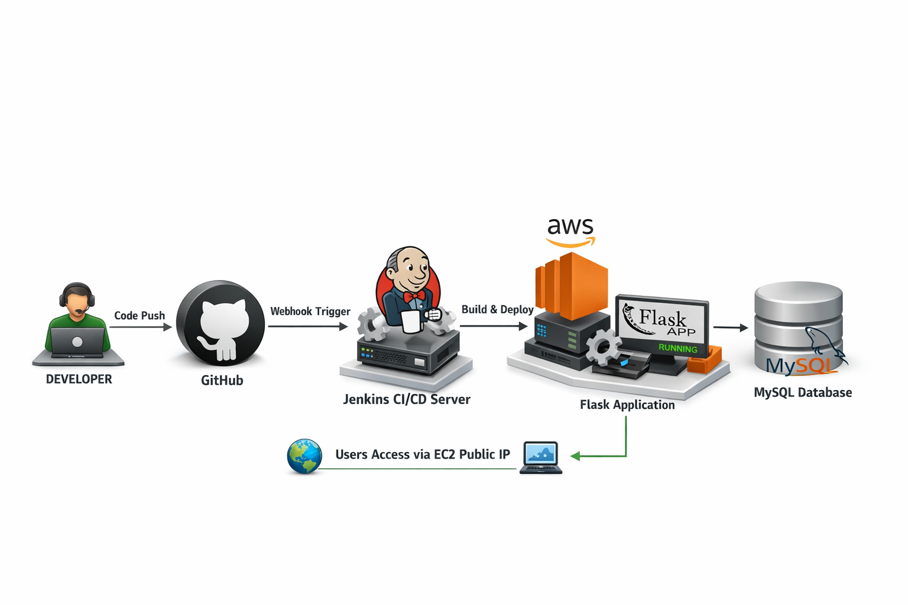
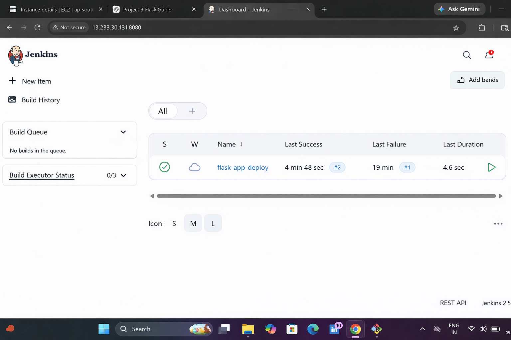
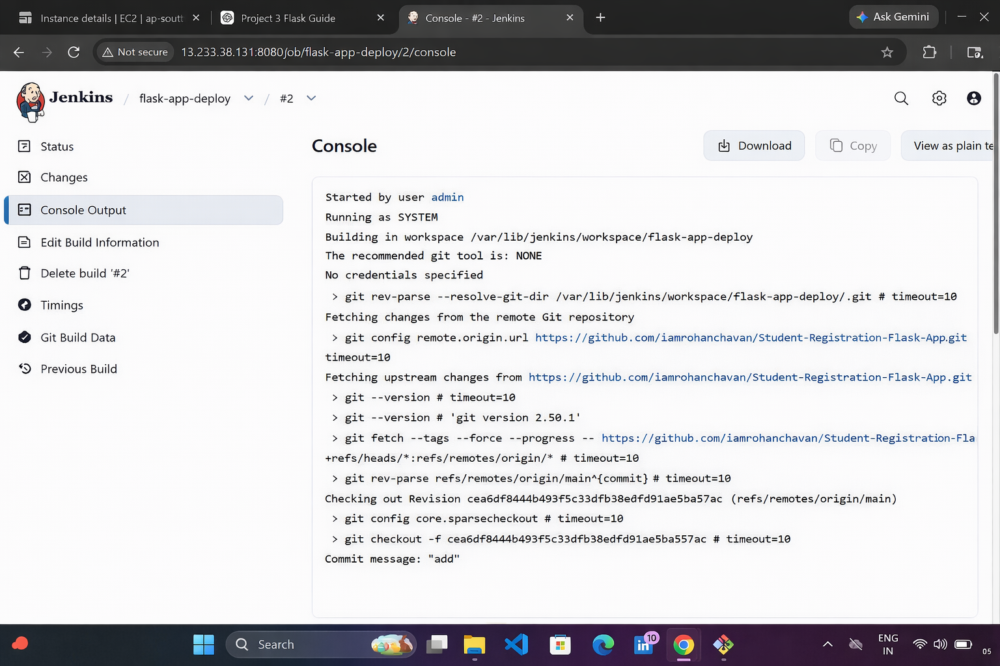
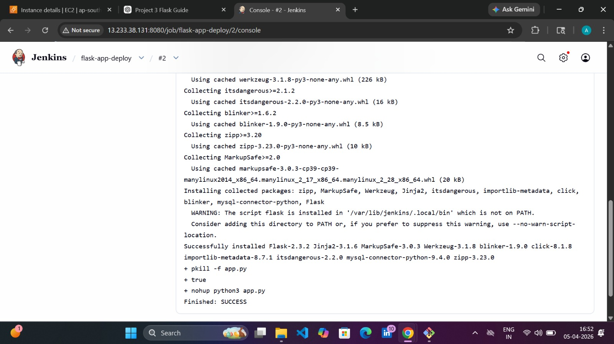
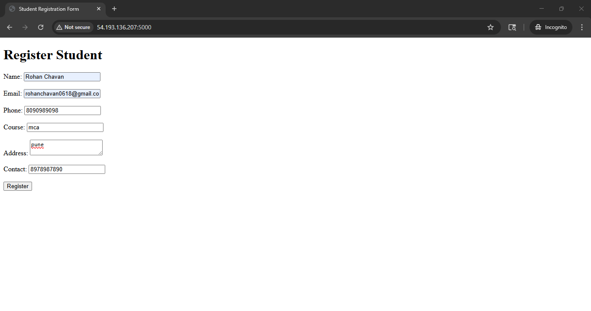
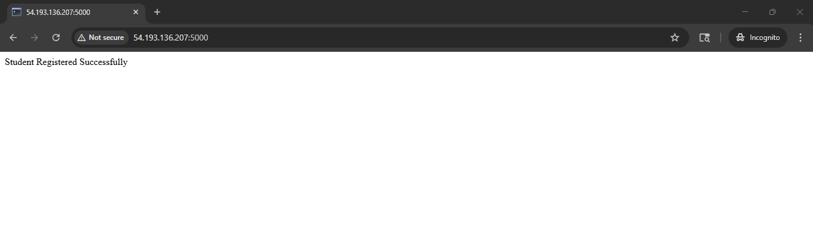
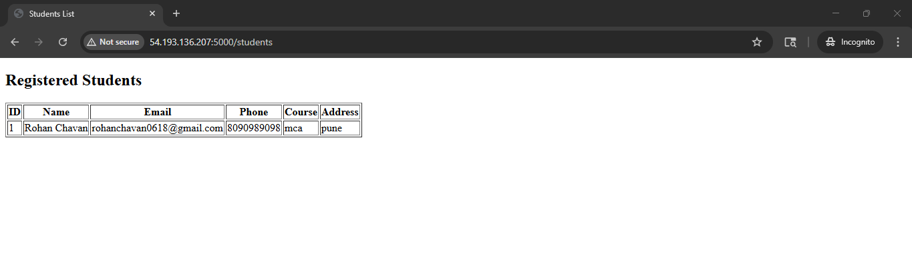
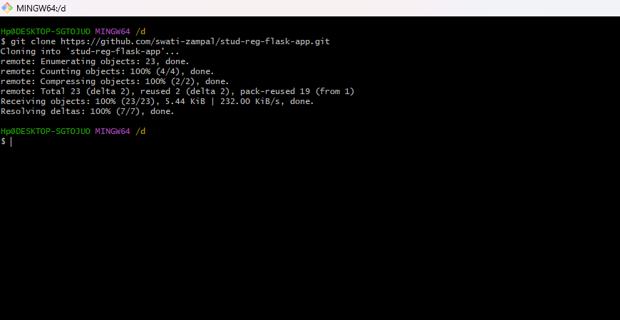

# 🚀 Student Registration Flask App – CI/CD with Jenkins


---

# 📌 Project Overview

This project demonstrates a **Student Registration Web Application** built using **Python Flask** and deployed using **Jenkins CI/CD pipeline** on an **AWS EC2 instance**.

The application allows users to submit student details through a web form and stores the data in a **MySQL database**.

---

# 🏗 Project Architecture



Flow:

Developer → GitHub → Jenkins → EC2 → Flask App → MySQL Database

---

# 🛠 Technologies Used

- Python 3
- Flask
- Jenkins
- MySQL
- AWS EC2
- Git & GitHub
- Linux

---

# ⚙ Jenkins Dashboard

Below image shows the Jenkins dashboard where the CI/CD pipeline is configured.



---

# ⚡ Jenkins Build Execution

This image shows Jenkins executing the build and deploying the application.




---

# 🌐 Application Interface

Below is the student registration form running on the EC2 server.






---

# 📥 Installation Steps

## Clone Repository

```
git clone https://github.com/swati-zampal/stud-reg-flask-app
cd stud-reg-flask-app
```

---

## Install Dependencies

```
pip3 install -r requirements.txt
```

---

## Run Flask Application

```
python3 app.py
```

Application will run at:

```
http://EC2-PUBLIC-IP:5000
```

---

# ⚡ Jenkins CI/CD Setup

## Step 1 Create Jenkins Job

Open Jenkins Dashboard  
Click **New Item**  
Select **Freestyle Project**

---

## Step 2 Connect GitHub Repository

Source Code Management → Git

```
https://github.com/Aniket6300/Student-Registration-Flask-App.git
```

---

## Step 3 Add Build Step

Build Step → Execute Shell

```
pip3 install -r requirements.txt
pkill -f app.py || true
nohup python3 app.py > output.log 2>&1 &
```

---

# 🔄 CI/CD Workflow

1️⃣ Developer pushes code to GitHub  
2️⃣ Jenkins pulls latest code  
3️⃣ Dependencies install automatically  
4️⃣ Flask application starts on EC2  
5️⃣ Users access application using EC2 Public IP  

---

# 👨‍💻 Author

**Rohan Chavan**

Cloud & DevOps Enthusiast
